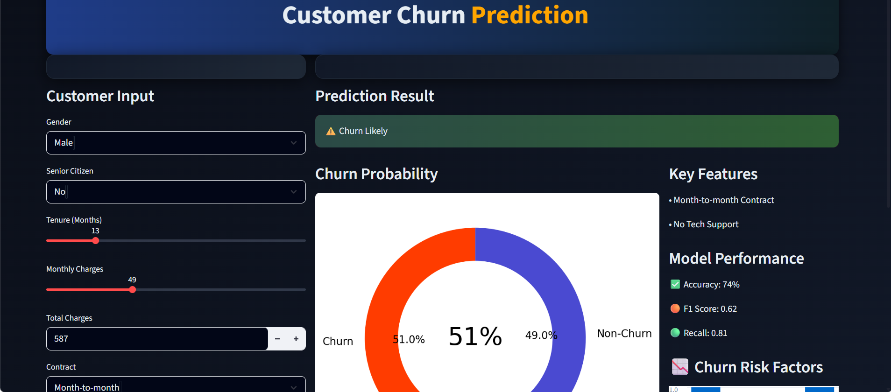
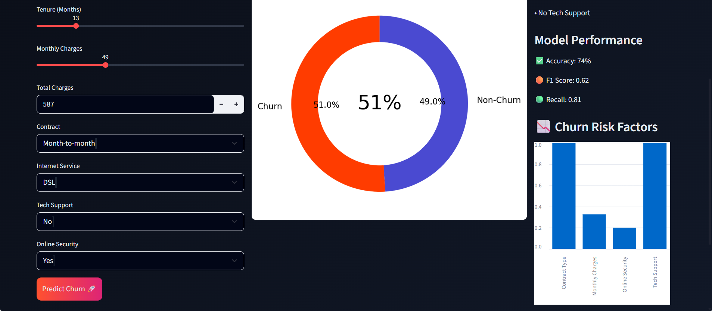

<div align="center">

# 📉 Customer Churn Prediction System

*"Losing a customer costs 5x more than retaining one. This system helps you act before it's too late."*

[](https://customer-churn-prediction-ml-twn4jqffobew3k3jqrlipe.streamlit.app/)
&nbsp;
[]()
&nbsp;
[]()

</div>

---

## 🧠 The Idea

Every business loses customers. The question is — **can you predict it before it happens?**

This project builds an end-to-end ML system that:
- Analyses real customer data (demographics, billing, services)
- Trains & compares **4 ML models** with full evaluation
- Picks the best model based on **business-focused metrics** (not just accuracy)
- Serves live predictions through an **interactive Streamlit dashboard**

---

## 📸 Dashboard Preview

<p align="center">
  <b>📊 Dashboard Overview — Output 1</b><br/><br/>
  
</p>

<br/>

<p align="center">
  <b>📊 Dashboard Overview — Output 2</b><br/><br/>
  
</p>

---

## ⚙️ ML Pipeline — Step by Step

```
Raw Customer Data
       │
       ▼
 🧹 Data Cleaning
  └─ Missing values · Duplicates · Type fixes
       │
       ▼
 🔧 Feature Engineering
  └─ Label Encoding · One-Hot Encoding · StandardScaler
       │
       ▼
 🤖 Model Training (4 Models)
  ├─ Logistic Regression
  ├─ K-Nearest Neighbors (KNN)
  ├─ Decision Tree
  └─ Support Vector Machine (SVM)
       │
       ▼
 🎯 Hyperparameter Tuning
  └─ RandomizedSearchCV
       │
       ▼
 📊 Evaluation → Best Model Selected
       │
       ▼
 🌐 Streamlit Dashboard → Live Prediction
```

---

## 📊 Model Performance

| Model | Accuracy | F1 Score | Recall |
|---|---|---|---|
| ✅ **Logistic Regression** | 0.74 | 0.62 | **0.81** |
| KNN | 0.76 | 0.54 | 0.53 |
| Decision Tree | 0.77 | 0.58 | 0.60 |
| SVM | 0.72 | 0.61 | 0.82 |

### 🏆 Why Logistic Regression Won

Most projects chase **Accuracy**. This one doesn't.

In churn prediction, missing a customer who's about to leave (False Negative) is far more costly than a wrong alert. So the model was selected on:

- **Recall = 0.81** → catches 81% of actual churners
- **F1 Score** → balanced precision & recall
- **Interpretability** → business teams can actually understand it

---

## 🧩 Input Features Used

```python
features = {
    "demographics" : ["Gender", "Senior Citizen Status"],
    "account"      : ["Tenure", "Contract Type", "Payment Method"],
    "billing"      : ["Monthly Charges", "Total Charges"],
    "services"     : ["Internet Service", "Tech Support", "Online Security"]
}
```

---

## 💼 Real Business Impact

| Problem | What This System Does |
|---|---|
| High churn rate | Flags at-risk customers early |
| Reactive retention | Enables proactive outreach |
| Guesswork decisions | Replaces gut-feel with data |
| Slow analysis | Real-time prediction dashboard |

---

## 🛠️ Tech Stack

```
Language    →  Python 3.10+
ML          →  Scikit-learn (LR · KNN · DT · SVM)
Data        →  Pandas · NumPy
Deployment  →  Streamlit
```

---

## 🚀 Run Locally

```bash
# 1. Clone
git clone https://github.com/BhairavThakare08/Customer-Churn-Prediction-ML.git
cd Customer-Churn-Prediction-ML

# 2. Install
pip install -r requirements.txt

# 3. Launch
streamlit run app.py
```

---

## 👨‍💻 Author

**Bhairav Thakare** — AI & Data Science Engineering Student

[](https://www.linkedin.com/in/bhairav-thakare-528137325)
[](https://github.com/BhairavThakare08)
[](mailto:bhairavthakare@gmail.com)

---

<div align="center">
  <sub>⭐ If this helped you understand churn prediction better, drop a star!</sub>
</div>
